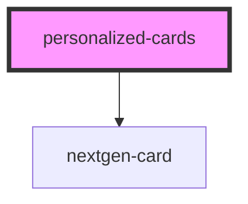

# personalized-cards

<!-- Auto Generated Below -->

## Usage

### Example

<personalized-cards id="sidebar-section__copay">
  <h2 slot="title">Copay Cards</h2>
  

    *Eligible patients pay as little as $10
    <a href="#">Terms and Conditions apply</a>
    <small>* Patients enrolled in state or federally funded prescription insurance programs are not eligible to use this card. Savings up to $970 per tube. Annual savings up to $3,880. This card will be accepted only at participating pharmacies. This card is not health insurance.</small>
  

</personalized-cards>

## Properties

| Property    | Attribute   | Description | Type                                                | Default            |
| ----------- | ----------- | ----------- | --------------------------------------------------- | ------------------ |
| `specialty` | `specialty` |             | `"Always Visible" or "Anatomic/Clinical Pathology"` | `'Always Visible'` |

## Dependencies

### Depends on

- nextgen-card

### Graph

----------------------------------------------

*Built with [StencilJS](https://stenciljs.com/)*
