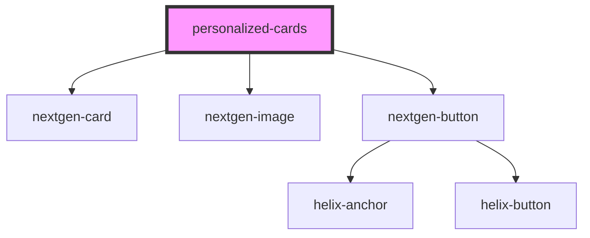

# personalized-cards

<!-- Auto Generated Below -->

## Usage

### Example

<personalized-cards id="sidebar-section__copay">
  <h2 slot="title">Copay Cards</h2>
  

    *Eligible patients pay as little as $10
    <a href="#">Terms and Conditions apply</a>
    <small>* Patients enrolled in state or federally funded prescription insurance programs are not eligible to use this card. Savings up to $970 per tube. Annual savings up to $3,880. This card will be accepted only at participating pharmacies. This card is not health insurance.</small>
  

</personalized-cards>

## Properties

| Property          | Attribute           | Description | Type                                                | Default                                                                                                                                                                                                                                                                 |
| ----------------- | ------------------- | ----------- | --------------------------------------------------- | ----------------------------------------------------------------------------------------------------------------------------------------------------------------------------------------------------------------------------------------------------------------------- |
| `cover`           | `cover`             |             | `string`                                            | `'https://www.pfizerpro.se/sites/default/files/herobanner_nya%20startsidan_0_0_0.jpg'`                                                                                                                                                                                  |
| `items`           | --                  |             | `any[]`                                             | `[{     title: 'Card 1', overlay: 'Card 1 overlay', specialty: 'Anatomic/Clinical Pathology', content: this.lorem, image: this.cover   },   {     title: 'Card 2', overlay: 'Card 2 overlay', specialty: 'Always Visible', content: this.lorem, image: this.cover   }]` |
| `itemsFiltered`   | --                  |             | `any[]`                                             | `[]`                                                                                                                                                                                                                                                                    |
| `lorem`           | `lorem`             |             | `string`                                            | `'Lorem Ipsum is simply dummy text of the printing and typesetting industry. Lorem Ipsum has been the industrys standard dummy text ever since the 1500s.'`                                                                                                             |
| `showReadingTime` | `show-reading-time` |             | `boolean`                                           | `false`                                                                                                                                                                                                                                                                 |
| `specialty`       | `specialty`         |             | `"Always Visible" or "Anatomic/Clinical Pathology"` | `'Always Visible'`                                                                                                                                                                                                                                                      |

## Dependencies

### Depends on

- nextgen-card
- nextgen-image
- nextgen-button

### Graph

----------------------------------------------

*Built with [StencilJS](https://stenciljs.com/)*
